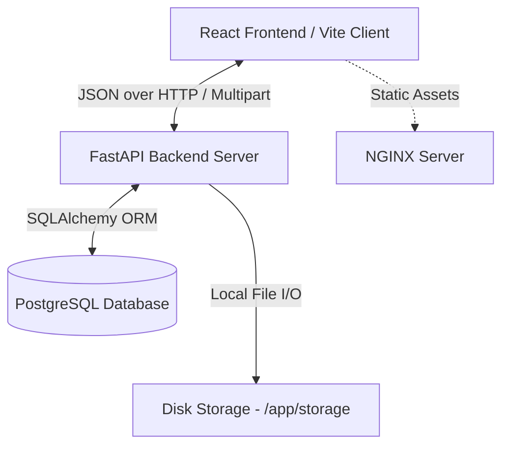
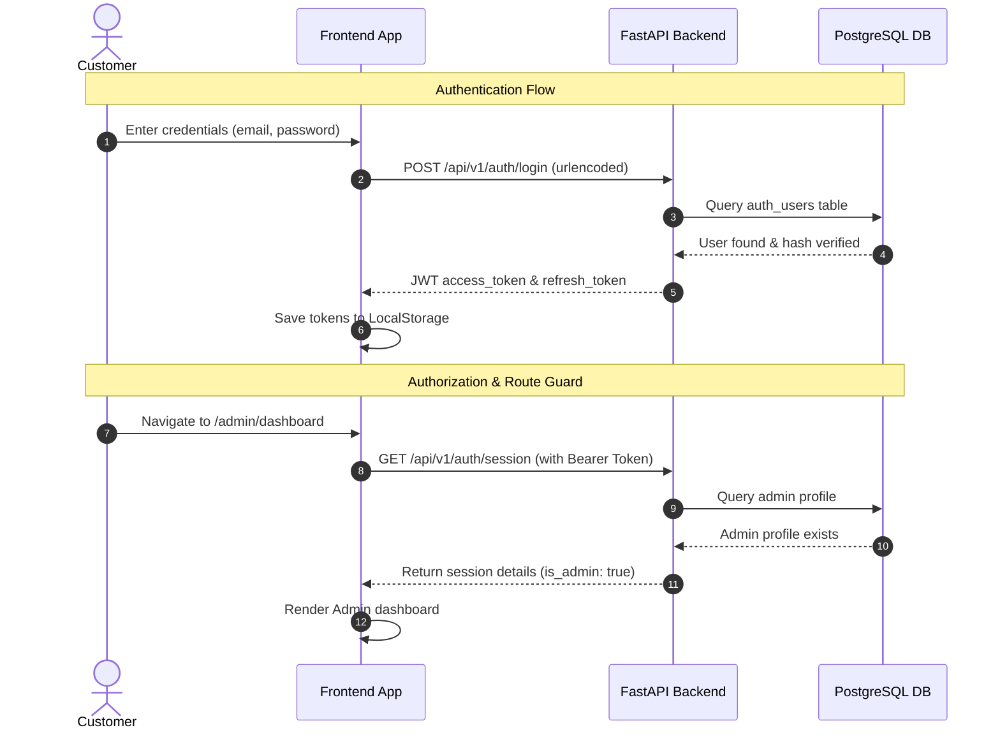
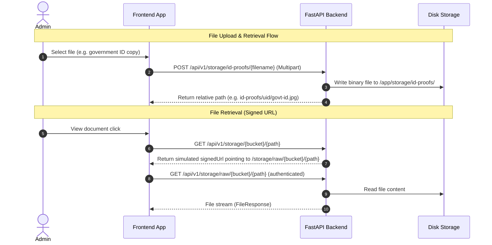
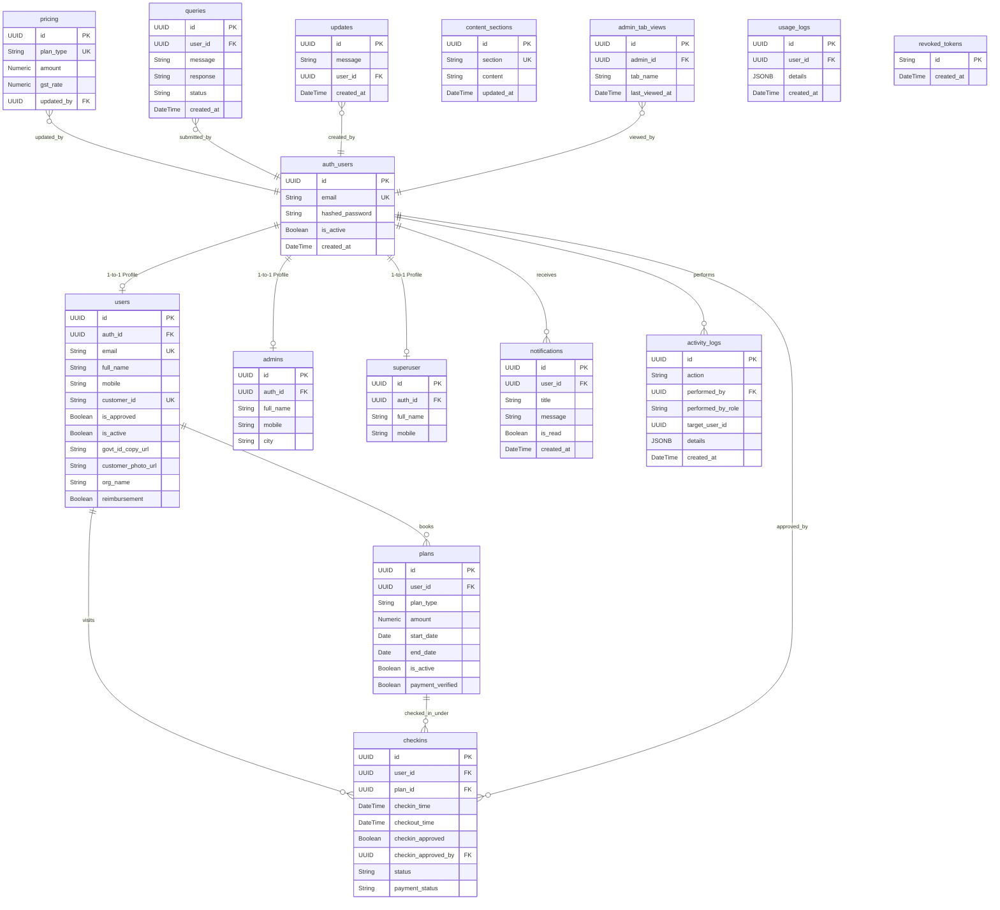
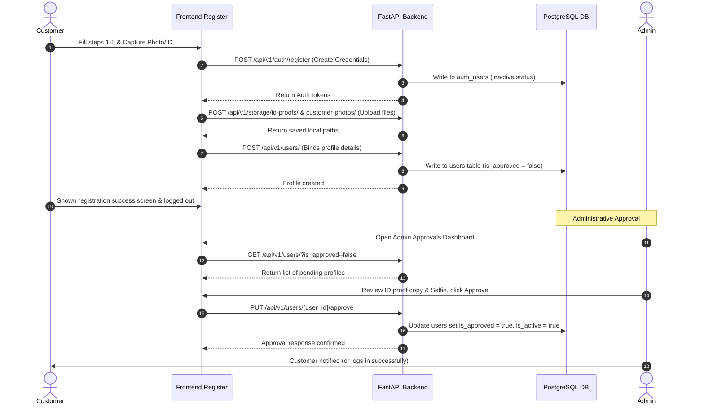
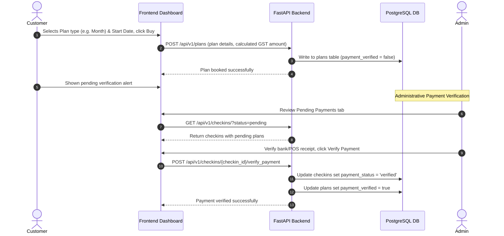
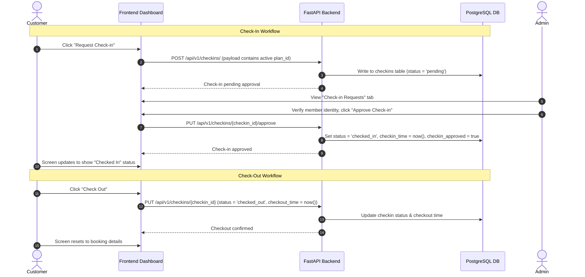
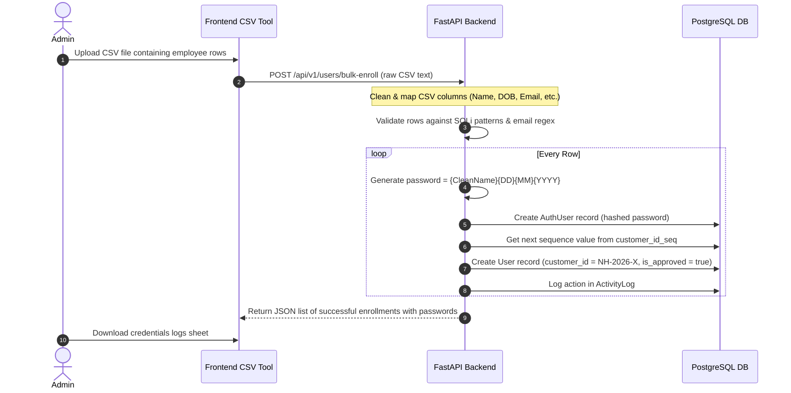

# Nerdshive Master Documentation

Welcome to the Master Documentation for **Nerdshive**, a premium coworking space management and workspace tracking application. This document provides complete technical, functional, database, and workflow specifications for the entire codebase.

---

## Table of Contents

1. [Project Overview](#1-project-overview)
2. [System Architecture](#2-system-architecture)
3. [Technology Stack](#3-technology-stack)
4. [Database Documentation](#4-database-documentation)
5. [API Documentation & Endpoint Matrix](#5-api-documentation--endpoint-matrix)
6. [Frontend Documentation & Mapping](#6-frontend-documentation--mapping)
7. [Business Workflows](#7-business-workflows)
8. [Authentication & Security](#8-authentication--security)
9. [File Storage System](#9-file-storage-system)
10. [Deployment & Operations Guide](#10-deployment--operations-guide)
11. [Testing Guide](#11-testing-guide)
12. [Known Issues, Limitations & Fix Log](#12-known-issues-limitations--fix-log)
13. [Troubleshooting Guide](#13-troubleshooting-guide)
14. [Project & Codebase Statistics](#14-project--codebase-statistics)
15. [Appendix](#15-appendix)

---

## 1. Project Overview

### Project Name
**Nerdshive**

### Purpose
Nerdshive is a digital platform built to streamline the operations of a collaborative coworking space. It provides self-registration, identity verification, space booking, and entry/exit (check-in/check-out) logs. By automating member enrollment, booking plan selections, check-in requests, and admin approvals, Nerdshive minimizes manual administration overhead while ensuring the workspace remains secure and restricted to verified professionals.

### Business Problem Solved
Coworking spaces often struggle with:
1. **Manual Entry Tracking**: Paper logbooks are prone to errors and hard to audit.
2. **Access Control & Security**: Restricting workspace usage only to members with valid, active bookings is complex.
3. **Billing Transparency**: Ensuring day, week, and monthly passes are active and payment-verified.
4. **Administrative Bottleneck**: Verifying corporate reimbursement requests, GST registrations, and government IDs takes considerable manual effort.
5. **Corporate Bulk Onboarding**: Registering hundreds of corporate employees individually is slow and error-prone.

Nerdshive resolves these problems by providing:
* A multi-step registration workflow that uploads and validates government IDs and photos.
* Self-booking for passes with automatic GST billing calculation.
* QR-like check-in requests that admins must approve at reception.
* Admin dashboards for bulk CSV employee imports with automatic password generation.
* Robust role-based access control (RBAC) to separate operational permissions.

### User Roles
The system enforces three distinct user roles:
1. **Customer (User)**: A regular coworking member. Customers register, submit photos/IDs, select and pay for plans, request check-ins at the physical venue, request check-outs, view workspace wifi/rules guide, and edit their settings.
2. **Admin**: Operational staff. Admins review and approve/reject pending registrations, approve check-in requests at reception, verify booking payments, reply to support queries, publish updates/announcements, and bulk-onboard users via CSV files.
3. **Superuser**: System owners. Superusers have all Admin privileges plus the authority to permanently delete user profiles, delete admins, and bulk-delete records during system maintenance.

### High-Level Architecture
Nerdshive is built as a decoupled, multi-container SPA web application.



---

## 2. System Architecture

Nerdshive uses a client-server architecture with containerized deployment.

### Frontend Architecture
* **SPA Router**: Client-side routing is handled by `react-router-dom` in [App.tsx](file:///e:/1/src/App.tsx).
* **State Management**: Handled via React state hooks and API data fetching is managed by React Query (`@tanstack/react-query`) for automated caching and background polling.
* **API Integration**: Axos client instance with interceptors configured in [apiClient.ts](file:///e:/1/src/lib/apiClient.ts) to automatically attach JWT bearer tokens.
* **View Layer**: Structured pages layout (Index, Login, Register, Dashboards) using reusable presentation components styled with Tailwind CSS and Radix UI primitives.

### Backend Architecture
* **Framework**: FastAPI (Python 3.11) with Uvicorn server in [main.py](file:///e:/1/backend/app/main.py).
* **Security & Auth**: PyJWT for token generation, Passlib with Bcrypt for secure password hashing.
* **Routing**: APIRouter mapping endpoints under `/api/v1` in [api.py](file:///e:/1/backend/app/api/v1/api.py).
* **Dependency Injection**: FastAPI `Depends` handles SQLAlchemy sessions and security checks in [deps.py](file:///e:/1/backend/app/api/deps.py).

### Database Architecture
* **Database Engine**: PostgreSQL 15.
* **ORM Layer**: SQLAlchemy 2.0 with a declarative base mapping models in `app/models`.
* **Migrations**: Alembic tracking schemas in `alembic/versions`.

### Security Flows (Authentication, Authorization, Upload, Check-in, Approval)





---

## 3. Technology Stack

### Frontend
* **Framework**: React 18.3.1.
* **Build Tool**: Vite 5.4.1 (with SWC plugin for fast compilation).
* **Language**: TypeScript 5.5.3.
* **CSS Framework**: Tailwind CSS 3.4.11 with custom configurations in [tailwind.config.ts](file:///e:/1/tailwind.config.ts).
* **State Management & Caching**: TanStack React Query 5.56.2.
* **UI Libraries**: Radix UI Primitives (Accordion, Dialog, Tabs, etc.), Lucide React (Icons), Sonner/Toast (Notifications).
* **Data Verification**: Zod 3.23.8 (schema validation), React Hook Form 7.53.0.
* **Utilities**: Axios 1.18.0 (HTTP client), XLSX (Excel/CSV parsing).

### Backend
* **Language**: Python 3.11.
* **Web Framework**: FastAPI 0.104.1.
* **ASGI Server**: Uvicorn 0.24.0.
* **ORM Engine**: SQLAlchemy 2.0.23.
* **DB Migration**: Alembic 1.12.1.
* **Validation**: Pydantic 2.5.2 (Data Schemas) & Pydantic Settings 2.1.0.
* **Security & Crypto**: PyJWT 2.8.0, Passlib 1.7.4 (Bcrypt), Python-Multipart.
* **Utility Libraries**: Pandas 2.1.3, Dateutil, Requests.

### Database
* **Database Engine**: PostgreSQL 15 (Alpine Linux Docker Image).
* **Connection Pooling**: Implemented via SQLAlchemy `pool_pre_ping=True`.
* **Primary Key ID Generation**: UUID v4 for records, Sequence serial counter for readable customer IDs.

### Infrastructure
* **Containerization**: Docker & Docker Compose version 3.8.
* **WebServer (Production)**: NGINX Alpine proxy serving built static assets and reverse-proxying API routes.
* **Volume Mounts**: Docker volumes for database persistency (`postgres_data`) and file storage directories (`/app/storage`).

---

## 4. Database Documentation

### Entity Relationship Diagram (ERD)



### Table Specifications

#### 1. `auth_users`
Stores user credentials and authentication states.
* **id**: `UUID` (Primary Key)
* **email**: `VARCHAR` (Unique, Indexed, Not Null)
* **hashed_password**: `VARCHAR` (Not Null)
* **is_active**: `BOOLEAN` (Default: `TRUE`)
* **created_at**: `TIMESTAMP` (Default: `now()`)

#### 2. `users`
Customer profile details.
* **id**: `UUID` (Primary Key)
* **auth_id**: `UUID` (Foreign Key -> `auth_users.id`, Unique, Not Null, `ON DELETE CASCADE`)
* **email**: `VARCHAR` (Unique, Indexed, Not Null)
* **full_name**: `VARCHAR` (Not Null)
* **gender**: `VARCHAR` (Nullable)
* **date_of_birth**: `DATE` (Nullable)
* **mobile**: `VARCHAR` (Not Null)
* **emergency_contact_name**: `VARCHAR` (Nullable)
* **emergency_contact_number**: `VARCHAR` (Not Null, Default: `""`)
* **org_name**: `VARCHAR` (Not Null, Default: `""`)
* **department**: `VARCHAR` (Nullable)
* **designation**: `VARCHAR` (Nullable)
* **employee_id**: `VARCHAR` (Nullable)
* **joining_date**: `DATE` (Nullable)
* **duration**: `VARCHAR` (Nullable)
* **govt_id_type**: `VARCHAR` (Not Null, Default: `""`)
* **govt_id_number**: `VARCHAR` (Not Null, Default: `""`)
* **requires_parking**: `BOOLEAN` (Default: `FALSE`)
* **vehicle_type**: `VARCHAR` (Nullable)
* **vehicle_brand_model**: `VARCHAR` (Nullable)
* **vehicle_color**: `VARCHAR` (Nullable)
* **vehicle_registration**: `VARCHAR` (Nullable)
* **customer_id**: `VARCHAR` (Unique, Indexed, Nullable)
* **enrollment_source**: `VARCHAR` (Default: `"self_registered"`)
* **customer_photo_url**: `VARCHAR` (Nullable)
* **is_approved**: `BOOLEAN` (Default: `FALSE`)
* **is_active**: `BOOLEAN` (Default: `TRUE`)
* **created_at**: `TIMESTAMP` (Default: `now()`)
* **updated_at**: `TIMESTAMP` (Default: `now()`)
* **city**: `VARCHAR` (Nullable)
* **location**: `VARCHAR` (Nullable)
* **occupation**: `VARCHAR` (Nullable)
* **govt_id_copy_url**: `VARCHAR` (Nullable)
* **reimbursement**: `BOOLEAN` (Default: `FALSE`)
* **gst_number**: `VARCHAR` (Nullable)
* **org_location**: `VARCHAR` (Nullable)

#### 3. `admins`
Admin profiles.
* **id**: `UUID` (Primary Key)
* **auth_id**: `UUID` (Foreign Key -> `auth_users.id`, Unique, Not Null, `ON DELETE CASCADE`)
* **full_name**: `VARCHAR` (Nullable)
* **mobile**: `VARCHAR` (Nullable)
* **city**: `VARCHAR` (Nullable)
* **location**: `VARCHAR` (Nullable)
* **occupation**: `VARCHAR` (Nullable)
* **created_at**: `TIMESTAMP` (Default: `now()`)

#### 4. `superuser`
Superuser profiles.
* **id**: `UUID` (Primary Key)
* **auth_id**: `UUID` (Foreign Key -> `auth_users.id`, Unique, Not Null, `ON DELETE CASCADE`)
* **full_name**: `VARCHAR` (Nullable)
* **mobile**: `VARCHAR` (Nullable)
* **city**: `VARCHAR` (Nullable)
* **location**: `VARCHAR` (Nullable)
* **occupation**: `VARCHAR` (Nullable)
* **created_at**: `TIMESTAMP` (Default: `now()`)

#### 5. `plans`
Coworking workspace plans booked by customers.
* **id**: `UUID` (Primary Key)
* **user_id**: `UUID` (Foreign Key -> `users.id`, Not Null, `ON DELETE CASCADE`)
* **plan_type**: `VARCHAR` (Not Null) e.g., `'day'`, `'week'`, `'month'`
* **amount**: `NUMERIC` (Not Null)
* **start_date**: `DATE` (Not Null)
* **end_date**: `DATE` (Not Null)
* **is_active**: `BOOLEAN` (Not Null, Default: `TRUE`)
* **payment_verified**: `BOOLEAN` (Default: `FALSE`)
* **created_at**: `TIMESTAMP` (Not Null, Default: `now()`)
* **updated_at**: `TIMESTAMP` (Not Null, Default: `now()`)

#### 6. `checkins`
Member space visits and check-in logs.
* **id**: `UUID` (Primary Key)
* **user_id**: `UUID` (Foreign Key -> `users.id`, Not Null, `ON DELETE CASCADE`)
* **plan_id**: `UUID` (Foreign Key -> `plans.id`, Not Null, `ON DELETE CASCADE`)
* **checkin_time**: `TIMESTAMP` (Nullable)
* **checkout_time**: `TIMESTAMP` (Nullable)
* **checkin_approved**: `BOOLEAN` (Default: `FALSE`)
* **checkin_approved_by**: `UUID` (Foreign Key -> `auth_users.id`, Nullable, `ON DELETE SET NULL`)
* **checkin_approved_at**: `TIMESTAMP` (Nullable)
* **status**: `VARCHAR` (Not Null, Default: `"pending"`) e.g., `'pending'`, `'checked_in'`, `'checked_out'`
* **payment_status**: `VARCHAR` (Default: `"pending"`)
* **payment_rejection_date**: `TIMESTAMP` (Nullable)
* **expired**: `BOOLEAN` (Default: `FALSE`)
* **updated_by**: `UUID` (Foreign Key -> `auth_users.id`, Nullable, `ON DELETE SET NULL`)
* **created_at**: `TIMESTAMP` (Not Null, Default: `now()`)
* **updated_at**: `TIMESTAMP` (Not Null, Default: `now()`)

#### 7. `pricing`
Pass catalog configuration.
* **id**: `UUID` (Primary Key)
* **plan_type**: `VARCHAR` (Unique, Not Null) e.g., `'day'`, `'week'`, `'month'`
* **amount**: `NUMERIC` (Not Null)
* **gst_rate**: `NUMERIC` (Not Null, Default: `18`)
* **updated_by**: `UUID` (Foreign Key -> `auth_users.id`, Nullable, `ON DELETE SET NULL`)
* **updated_at**: `TIMESTAMP` (Not Null, Default: `now()`)

#### 8. `notifications`
System alerts pushed to users.
* **id**: `UUID` (Primary Key)
* **user_id**: `UUID` (Foreign Key -> `auth_users.id`, Not Null, `ON DELETE CASCADE`)
* **title**: `VARCHAR` (Not Null)
* **message**: `VARCHAR` (Not Null)
* **type**: `VARCHAR` (Not Null, Default: `"info"`)
* **is_read**: `BOOLEAN` (Not Null, Default: `FALSE`)
* **data**: `JSONB` (Nullable)
* **created_at**: `TIMESTAMP` (Not Null, Default: `now()`)

#### 9. `activity_logs`
Audit trails for actions done by Admins and Superusers.
* **id**: `UUID` (Primary Key)
* **action**: `VARCHAR` (Not Null)
* **performed_by**: `UUID` (Foreign Key -> `auth_users.id`, Nullable, `ON DELETE SET NULL`)
* **performed_by_name**: `VARCHAR` (Nullable)
* **performed_by_role**: `VARCHAR` (Nullable)
* **target_user_id**: `UUID` (Nullable)
* **target_user_name**: `VARCHAR` (Nullable)
* **target_user_email**: `VARCHAR` (Nullable)
* **details**: `JSONB` (Nullable)
* **created_at**: `TIMESTAMP` (Not Null, Default: `now()`)

#### 10. `updates`
Announcements visible to customers.
* **id**: `UUID` (Primary Key)
* **message**: `VARCHAR` (Not Null)
* **type**: `VARCHAR` (Nullable)
* **user_id**: `UUID` (Foreign Key -> `auth_users.id`, Nullable, `ON DELETE SET NULL`)
* **created_at**: `TIMESTAMP` (Not Null, Default: `now()`)

#### 11. `admin_tab_views`
Monitors admin read state of logs.
* **id**: `UUID` (Primary Key)
* **admin_id**: `UUID` (Foreign Key -> `auth_users.id`, Not Null, `ON DELETE CASCADE`)
* **tab_name**: `VARCHAR` (Not Null)
* **last_viewed_at**: `TIMESTAMP` (Not Null, Default: `now()`)
* **created_at**: `TIMESTAMP` (Not Null, Default: `now()`)

#### 12. `usage_logs`
Coworker access logs.
* **id**: `UUID` (Primary Key)
* **user_id**: `UUID` (Foreign Key -> `auth_users.id`, Nullable, `ON DELETE CASCADE`)
* **details**: `JSONB` (Nullable)
* **created_at**: `TIMESTAMP` (Not Null, Default: `now()`)

#### 13. `queries`
User support tickets/inquiries.
* **id**: `UUID` (Primary Key)
* **user_id**: `UUID` (Foreign Key -> `auth_users.id`, Nullable, `ON DELETE CASCADE`)
* **message**: `VARCHAR` (Not Null)
* **response**: `VARCHAR` (Nullable)
* **status**: `VARCHAR` (Default: `"pending"`)
* **created_at**: `TIMESTAMP` (Not Null, Default: `now()`)

#### 14. `content_sections`
Content details like Wi-Fi details, guides, and policies.
* **id**: `UUID` (Primary Key)
* **section**: `VARCHAR` (Unique, Not Null) e.g., `'rules'`, `'guide'`, `'wifi'`
* **content**: `VARCHAR` (Not Null)
* **updated_at**: `TIMESTAMP` (Default: `now()`)

#### 15. `revoked_tokens`
Invalidated JWT tokens.
* **id**: `VARCHAR` (Primary Key)
* **created_at**: `TIMESTAMP` (Default: `now()`)

---

## 5. API Documentation & Endpoint Matrix

All endpoint routes are prefixed by `/api/v1` and return structured JSON responses.

### Complete API Endpoint Matrix

| Method | Route | Auth Required | Role Required | Request Schema | Response Schema | Frontend Service & Component Calling |
| :--- | :--- | :---: | :--- | :--- | :--- | :--- |
| **POST** | `/auth/login` | No | Any | OAuth2 Form (username, password) | `Token` (access, refresh tokens) | `authService.login()` <br> [Login.tsx](file:///e:/1/src/pages/Login.tsx) |
| **POST** | `/auth/register` | No | Any | `AuthUserCreate` | `Token` | `authService.register()` <br> [Register.tsx](file:///e:/1/src/pages/Register.tsx) |
| **POST** | `/auth/refresh` | No | Any | `{refresh_token: string}` | `Token` | Internal Axios interceptor |
| **POST** | `/auth/password-recovery` | No | Any | `{email: string}` | `{msg: string}` | `authService.recoverPassword()` <br> [Login.tsx](file:///e:/1/src/pages/Login.tsx) |
| **POST** | `/auth/reset-password` | No | Any | `{token, new_password}` | `{msg: string}` | `authService.resetPassword()` <br> [ResetPassword.tsx](file:///e:/1/src/pages/ResetPassword.tsx) |
| **POST** | `/auth/logout` | Yes | Any | None (Bearer Token) | `{msg: string}` | `authService.logout()` <br> Header navbar controls |
| **GET** | `/auth/session` | Yes | Any | None | User profile & roles payload | `authService.getSession()` <br> [AuthGuard](file:///e:/1/src/components/ui/auth-guard.tsx) |
| **POST** | `/auth/change-password` | Yes | Any | `ChangePassword` | `{msg: string}` | `authService.changePassword()` <br> [Settings.tsx](file:///e:/1/src/pages/Settings.tsx) |
| **GET** | `/users/me` | Yes | Any | None | `UserResponse` \| `AdminResponse` | `userService.getMe()` <br> [Settings.tsx](file:///e:/1/src/pages/Settings.tsx) |
| **PUT** | `/users/me` | Yes | Any | `UserUpdate` | `UserResponse` \| `AdminResponse` | `userService.updateMe()` <br> [Settings.tsx](file:///e:/1/src/pages/Settings.tsx) |
| **GET** | `/users/` | Yes | Admin \| Superuser | Query params: `skip`, `limit`, `is_approved` | `List[UserResponse]` | `adminService.getUsers()` <br> [AdminDashboard.tsx](file:///e:/1/src/pages/AdminDashboard.tsx) |
| **POST** | `/users/` | Yes | Any | `UserCreate` | `UserResponse` | `apiClient.post('/users/')` <br> [Register.tsx](file:///e:/1/src/pages/Register.tsx) |
| **GET** | `/users/{user_id}` | Yes | Owner \| Admin | Path parameter `user_id` | `UserResponse` | `userService.getUserById()` <br> Settings page loading |
| **PUT** | `/users/{user_id}/approve` | Yes | Admin \| Superuser | Path parameter `user_id` | `UserResponse` | `adminService.approveUser()` <br> Admin approvals tab |
| **PUT** | `/users/{user_id}/reject` | Yes | Admin \| Superuser | `{reason: string}` (Body) | `UserResponse` | `adminService.rejectUser()` <br> Admin approvals tab |
| **PUT** | `/users/{user_id}/inactive` | Yes | Admin \| Superuser | Path parameter | `UserResponse` | `adminService.makeUserInactive()` <br> Details expand tab |
| **POST** | `/users/delete` | Yes | Superuser | `UserDeleteSchema` | `{msg: string}` | `userService.deleteUser()` <br> [SuperuserDashboard.tsx](file:///e:/1/src/pages/SuperuserDashboard.tsx) |
| **DELETE**| `/users/` | Yes | Superuser | None | `{msg: string}` | `apiClient.delete('/users/')` <br> [SuperuserDashboard.tsx](file:///e:/1/src/pages/SuperuserDashboard.tsx) |
| **POST** | `/users/bulk-enroll` | Yes | Admin \| Superuser | `BulkEnrollInput` (csvData, fileName) | Verification logs, accounts stats | `apiClient.post('/users/bulk-enroll')`<br>[BulkEnrollmentTab.tsx](file:///e:/1/src/components/BulkEnrollmentTab.tsx) |
| **POST** | `/admins/invite` | Yes | Superuser | `AdminInviteSchema` | `AdminResponse` | `adminService.inviteAdmin()` <br> Admin management tab |
| **GET** | `/admins/` | Yes | Superuser | Query params: `page`, `limit` | `List[AdminResponse]` | `adminService.getAdmins()` <br> Superuser Dashboard |
| **DELETE**| `/admins/` | Yes | Superuser | None | `{msg: string}` | `apiClient.delete('/admins/')` <br> Superuser admin logs clean |
| **GET** | `/admins/me` | Yes | Admin \| Superuser | None | `AdminResponse` | `adminService.getMe()` <br> Settings page loading |
| **DELETE**| `/admins/{admin_id}` | Yes | Superuser | Path parameter | `{msg: string}` | `adminService.deleteAdmin()` <br> Superuser admin list |
| **POST** | `/checkins/` | Yes | Any | `CheckinCreate` | `CheckinResponseNested` | `businessService.createCheckin()` <br> [CheckInOutTab.tsx](file:///e:/1/src/components/CheckInOutTab.tsx) |
| **PUT** | `/checkins/{checkin_id}` | Yes | Any | `CheckinUpdate` | `CheckinResponseNested` | `businessService.updateCheckin()` <br> [CheckInOutTab.tsx](file:///e:/1/src/components/CheckInOutTab.tsx) |
| **PUT** | `/checkins/{checkin_id}/approve`| Yes | Admin \| Superuser | Path parameter | `CheckinResponseNested` | `businessService.approveCheckin()` <br> Check-in Approvals tab |
| **POST** | `/checkins/{checkin_id}/verify_payment`| Yes | Admin \| Superuser | Path parameter | `{msg: string}` | `businessService.verifyPayment()` <br> Payment verification tab |
| **DELETE**| `/checkins/{checkin_id}` | Yes | Admin \| Superuser | Path parameter | `{msg: string}` | `businessService.deleteCheckin()` <br> Check-in delete button |
| **GET** | `/dashboard/stats` | Yes | Admin \| Superuser | None | Users count, active plans, check-ins | `dashboardService.getStats()` <br> Admin & Superuser stats counters |
| **GET** | `/dashboard/metrics` | Yes | Admin \| Superuser | None | Time-series charts data | `dashboardService.getMetrics()` <br> Admin charts components |
| **GET** | `/notifications/` | Yes | Any | Query params: `page`, `limit` | `List[NotificationResponse]` | `notificationService.getNotifications()` <br> [NotificationBell.tsx](file:///e:/1/src/components/ui/notification-bell.tsx) |
| **PUT** | `/notifications/{notification_id}/read`| Yes | Any | Path parameter | `NotificationResponse` | `notificationService.markAsRead()` <br> Bell notification click |
| **PUT** | `/notifications/read-all` | Yes | Any | None | `{msg: string}` | `notificationService.markAllAsRead()` <br> Bell marks clean-all |
| **GET** | `/plans/my` | Yes | Customer | None | `List[PlanResponse]` | `businessService.getMyPlans()` <br> [Dashboard.tsx](file:///e:/1/src/pages/Dashboard.tsx) |
| **GET** | `/plans` | Yes | Admin \| Superuser | Query params: `page`, `limit` | `List[PlanResponse]` | `businessService.getPlans()` <br> Admin logs view |
| **POST** | `/plans` | Yes | Any | `PlanCreate` | `PlanResponse` | `businessService.createPlan()` <br> Book plan tab logic |
| **GET** | `/pricing` | No | Any | None | `List[PricingResponse]` | `businessService.getPricing()` <br> Book Plan tab & Admin tab |
| **PUT** | `/pricing/update` | Yes | Admin \| Superuser | `PricingUpdate` | `PricingResponse` | `businessService.updatePricing()` <br> Settings config panel |
| **GET** | `/checkins/my` | Yes | Customer | None | `List[CheckinResponseNested]` | `businessService.getMyCheckins()` <br> Check-in tab logs |
| **GET** | `/checkins/` | Yes | Admin \| Superuser | Query params: `status`, `checkin_approved` | `List[CheckinResponseNested]` | `businessService.getCheckins()` <br> Approvals dashboard lists |
| **POST** | `/checkins/expired/mark` | Yes | Admin \| Superuser | None | `{msg: string}` | `businessService.markExpiredCheckins()` <br> Admin logs clean tools |
| **POST** | `/checkins/expired/delete-old` | Yes | Admin \| Superuser | None | `{msg: string}` | `businessService.deleteOldExpiredCheckins()` <br> Admin database tools |
| **POST** | `/storage/upload` | Yes | Any | Multipart file | `{info: string}` | `storageService.uploadFile()` <br> Document uploads settings |
| **POST** | `/storage/id-proofs/{filename:path}`| Yes | Any | Multipart file, Path param | `{path: string}` | `storageService.uploadIdProof()` <br> Registration step 3 |
| **POST** | `/storage/customer-photos/{filename:path}`| Yes | Any | Multipart file, Path param | `{path: string}` | `storageService.uploadCustomerPhoto()` <br> Registration step 4 |
| **GET** | `/storage/raw/{bucket}/{path:path}` | Yes | Any | Path parameters | Raw file stream binary | Simulates private download access control |
| **GET** | `/storage/{bucket}/{path:path}` | Yes | Any | Path parameters | `{signedUrl: string}` | `storageService.getFileUrl()` <br> Admin image viewer modals |
| **GET** | `/storage/{filename}` | Yes | Any | Path parameter | Secure raw file response | Direct download link actions |
| **GET** | `/usage_logs` | Yes | Admin \| Superuser | Query params: `page`, `limit`, `sort` | `List[UsageLogResponse]` | `dashboardService.getUsageLogs()` <br> Usage history tracking logs |
| **GET** | `/updates` | Yes | Any | None | `List[UpdateLogResponse]` | `dashboardService.getUpdates()` <br> Updates notifications logs |
| **GET** | `/queries/my` | Yes | Any | None | `List[QueryLogResponse]` | `dashboardService.getMyQueries()` <br> [Dashboard.tsx](file:///e:/1/src/pages/Dashboard.tsx) |
| **GET** | `/queries` | Yes | Admin \| Superuser | Query params: `status`, `page`, `limit` | `List[QueryLogResponse]` | `dashboardService.getQueries()` <br> Admin Support Queries list |
| **POST** | `/queries` | Yes | Any | `QueryLogCreate` | `QueryLogResponse` | `dashboardService.createQuery()` <br> [Dashboard.tsx](file:///e:/1/src/pages/Dashboard.tsx) |
| **PUT** | `/queries/{query_id}` | Yes | Admin \| Superuser | `QueryUpdateSchema` | `QueryLogResponse` | `dashboardService.updateQuery()` <br> Admin responds modal |
| **GET** | `/activity_logs/count` | Yes | Admin \| Superuser | None | Number of new actions performed | `dashboardService.getActivityCount()` <br> Admin log sidebar badges |
| **GET** | `/activity_logs` | Yes | Admin \| Superuser | Query params: `page`, `limit`, `sort` | `List[ActivityLogResponse]` | `auditService.getActivityLogs()` <br> Activity tabs lists |
| **POST** | `/activity_logs` | Yes | Any | `action` (Query parameter) | `ActivityLogResponse` | `auditService.createActivityLog()` <br> Custom actions auditing |
| **GET** | `/content_sections` | No | Any | None | `List[ContentSectionResponse]` | `dashboardService.getContentSections()` <br> Guide rules & wifi views |
| **POST** | `/content_sections` | Yes | Admin \| Superuser | `ContentSectionCreate` | `ContentSectionResponse` | `adminService.updateContent()` <br> Workspace details editor panel |
| **POST** | `/admin_tab_views` | Yes | Admin \| Superuser | `AdminTabViewCreate` | `{msg: string}` | `auditService.updateAdminTabView()` <br> Admin dashboard page load |

---

## 6. Frontend Documentation & Mapping

### Pages Directory (`src/pages`)

1. **Index (`/`)**: Displays the hero landing page describing the coworking space (flexible plans, community benefits, verification rules), with navigation routes leading to `/login` and `/register`.
2. **Login (`/login`)**: The authentication entry point. Displays credential inputs (email, password), forgot password triggering a recovery dialog modal, and handles redirects depending on returned RBAC session states.
3. **Register (`/register`)**: Multi-step coworker registration form:
   * **Step 1 (Basic Details)**: Full Name, email, password selection, confirm password.
   * **Step 2 (Personal Details)**: Gender, Mobile, City, Location, Occupation, corporate reimbursement options (GST No, Organization Name/Location).
   * **Step 3 (ID Proof Upload)**: Capture document photo via device webcam overlay.
   * **Step 4 (Identity Selfie)**: Capture selfie snapshot using webcam.
   * **Step 5 (Review)**: Summary confirmation before submission.
4. **Dashboard (`/dashboard`)**: The primary workspace hub for verified active customers. Structured into tabs:
   * **Book Plan**: Select plan type (day/week/month) and pick a start date.
   * **Check In/Out**: Request check-in or submit check-out requests.
   * **History**: Lists past visits and billed payments.
   * **Query**: Submits support logs and tracks admin feedback responses.
   * **Updates**: Lists announcements published by administrators.
   * **Guide**: Explains policies, Wi-Fi keys, and space guides.
5. **Admin Dashboard (`/admin/dashboard`)**: Admin control panel. Formatted as tabs:
   * **Approvals**: Contains sub-tabs for customer registrations, check-in requests, and pending payments verification.
   * **Bulk Onboarding**: Drag-and-drop CSV parser.
   * **Queries**: Manage and answer support tickets.
   * **Content Sections**: Rich editor to update guides, wifi details, and rules.
   * **Audit Log**: Chronological trail of administrator activities.
6. **Superuser Dashboard (`/superuser/dashboard`)**: Enhanced dashboard panel. Contains all Admin tabs plus the **Admins Management** tab (invite admins, view admin logs, delete administrators) and **System Maintenance tools** (bulk clean/delete test coworker data).
7. **Reset Password (`/reset-password`)**: Recovers passwords using temporary reset query tokens.
8. **Settings (`/settings`)**: Interactive configuration tab allowing profile edits (mobile, city, reimbursement variables) and document updates (capturing new government IDs/selfies) with strict validation.
9. **Inactive User (`/inactive-user`)**: Warning screen displayed if an administrator deactivates a coworker. Suggests re-registering to trigger approval loops.
10. **NotFound (`*`)**: Handles invalid router navigation.

### Frontend → Backend Component Mapping Matrix

| Frontend Page | Component File / Tab | API Called | Backend Endpoint | Purpose |
| :--- | :--- | :--- | :--- | :--- |
| **Login** | [Login.tsx](file:///e:/1/src/pages/Login.tsx) | `authService.login()` | `POST /auth/login` | Authenticate credentials & retrieve access/refresh tokens |
| **Register** | [Register.tsx](file:///e:/1/src/pages/Register.tsx) | `authService.register()` | `POST /auth/register` | Create auth credential entry in backend database |
| **Register** | [Register.tsx](file:///e:/1/src/pages/Register.tsx) | `storageService.uploadIdProof()` | `POST /storage/id-proofs/{file}` | Upload government ID document binary securely to disk |
| **Register** | [Register.tsx](file:///e:/1/src/pages/Register.tsx) | `storageService.uploadCustomerPhoto()` | `POST /storage/customer-photos/` | Upload profile selfie binary securely to disk |
| **Register** | [Register.tsx](file:///e:/1/src/pages/Register.tsx) | `apiClient.post('/users/')` | `POST /users/` | Bind profile fields with the auth UUID record |
| **Customer Hub** | Book Plan Tab | `businessService.getPricing()` | `GET /pricing` | Populate catalog plan pricing options |
| **Customer Hub** | Book Plan Tab | `businessService.createPlan()` | `POST /plans` | Book day/week/monthly workspace access |
| **Customer Hub** | Check In/Out Tab | [CheckInOutTab.tsx](file:///e:/1/src/components/CheckInOutTab.tsx) | `POST /checkins/` | Register check-in request pending reception approval |
| **Customer Hub** | Check In/Out Tab | [CheckInOutTab.tsx](file:///e:/1/src/components/CheckInOutTab.tsx) | `PUT /checkins/{id}` | Execute check-out by modifying status to `'checked_out'` |
| **Customer Hub** | Query Tab | `dashboardService.createQuery()` | `POST /queries` | Send support requests to operational staff |
| **Admin Panel** | Approvals Tab | [CheckInApprovalTab.tsx](file:///e:/1/src/components/CheckInApprovalTab.tsx) | `PUT /checkins/{id}/approve` | Verify reception check-in and mark as `'checked_in'` |
| **Admin Panel** | Approvals Tab | [PaymentVerificationTab.tsx](file:///e:/1/src/components/PaymentVerificationTab.tsx) | `POST /checkins/{id}/verify_payment` | Verify billing checks & activate plans payment states |
| **Admin Panel** | Bulk Onboarding | [BulkEnrollmentTab.tsx](file:///e:/1/src/components/BulkEnrollmentTab.tsx) | `POST /users/bulk-enroll` | Upload corporate employee list CSV for automatic seeding |
| **Superuser Panel** | Admins Tab | `adminService.inviteAdmin()` | `POST /admins/invite` | Add a new administrative user to the platform |
| **Settings** | Security Tab | `authService.changePassword()` | `POST /auth/change-password` | Update current authenticated user's password hash |

---

## 7. Business Workflows

### 1. Customer Registration & Approval Workflow


### 2. Plan Booking & Payment Verification Workflow


### 3. Check-In & Check-Out Workflows


### 4. Bulk Employee Enrollment Workflow


---

## 8. Authentication & Security

### JWT Auth Flow
Nerdshive uses JWT tokens for stateless authentication:
1. **Access Tokens**: Short-lived access signature (expires in 7 days as configured in `ACCESS_TOKEN_EXPIRE_MINUTES`). Encodes user id, token type (`type = "access"`), and expiration metadata.
2. **Refresh Tokens**: Long-lived tokens (expires in 7 days, type: `"refresh"`) used to request new access tokens at `/auth/refresh` without prompting credentials.
3. **Revocation**: Logouts write the active token to the `revoked_tokens` table. The dependency check `get_current_auth_user` queries this table, invalidating blacklisted tokens immediately.

### Role-Based Access Control (RBAC)
FastAPI dependencies in [deps.py](file:///e:/1/backend/app/api/deps.py) enforce RBAC checks:
* **`get_current_auth_user`**: Verifies valid JWT token and active user account.
* **`get_current_active_customer`**: Asserts the user has a valid profile in the `users` table.
* **`get_current_admin`**: Asserts the user has a record in either `admins` or `superuser` profiles.
* **`get_current_superuser`**: Restricts access exclusively to records in the `superuser` profile.

### Protected Routes (Frontend)
The `<AuthGuard>` component in [auth-guard.tsx](file:///e:/1/src/components/ui/auth-guard.tsx) wraps pages and matches session roles:
* If no active session, redirects user to `/login`.
* If a customer attempts to open `/admin/dashboard`, they are redirected to `/dashboard`.
* If an admin attempts to open `/superuser/dashboard`, they are redirected to `/admin/dashboard`.
* If a regular customer is marked inactive, they are immediately signed out and navigated to `/inactive-user`.

### File and Document Security
* File binaries are kept in `/app/storage/`, which is outside the public web root.
* To read a document, the client requests a simulated signed URL via `GET /storage/{bucket}/{path}`.
* The backend generates a temporary URL pointing to `GET /storage/raw/{bucket}/{path}`.
* When retrieving the raw file, the endpoint validates that the requester is either the **file owner** (matching the UUID prefixed on the filename) or an **authorized Admin/Superuser**. Unauthorized attempts return `403 Forbidden`.

### Input Validation & Sanitization
* **SQL Injection & XSS Filters**: Sanitization patterns run against bulk csv records matching patterns like `<script>`, `DROP TABLE`, `ALTER TABLE`, and HTML tags.
* **Regex Fields**: Registration validates phone numbers against Indian formats (`/^[6-9]\d{9}$/`), validates GST numbers, and strictly validates passport and driving license formats.

---

## 9. File Storage System

### Disk Storage Structure
Uploaded media is organized under the directory specified in `settings.STORAGE_DIR` (default: `/app/storage`):
* **`/app/storage/id-proofs/`**: Contains webcam snaps of ID proofs. Paths follow the format `id-proofs/{auth_id}/govt-id.jpg`.
* **`/app/storage/customer-photos/`**: Contains webcam selfies. Paths follow the format `customer-photos/{auth_id}/customer-photo.jpg`.

### File Upload and Download API Specs

1. **Upload ID Proof**: `POST /api/v1/storage/id-proofs/{filename:path}`
   * Uploads multipart image binary.
   * Restricts files to government ID subdirectories.
2. **Upload Photo**: `POST /api/v1/storage/customer-photos/{filename:path}`
   * Uploads selfie image.
3. **Simulate Signed URL**: `GET /api/v1/storage/{bucket}/{path:path}`
   * Returns a signed URL payload: `{"signedUrl": "http://host:port/api/v1/storage/raw/{bucket}/{path}"}`.
4. **Serve Raw Binary**: `GET /api/v1/storage/raw/{bucket}/{path:path}`
   * Performs authorization logic. Returns `FileResponse` if authorized.

---

## 10. Deployment & Operations Guide

### Prerequisites
* Docker engine (20.10+) & Docker Compose installed.
* Ports `80` and `8001` available.

### Setup Steps using Docker Compose

1. **Create Environment Configuration**: Save variables to a `.env` file in the project root:
   ```env
   POSTGRES_USER=app_user
   POSTGRES_PASSWORD=password123
   POSTGRES_DB=app_db
   SECRET_KEY=generate_a_very_secure_long_random_string_here_for_jwt
   VITE_API_URL=http://localhost:8001/api/v1
   ```
2. **Build and Run Containers**:
   ```bash
   docker-compose up --build -d
   ```
   This command starts three services:
   * `db`: PostgreSQL 15-alpine on port `5432`.
   * `backend`: FastAPI app running on port `8000` (mapped to host port `8001`).
   * `frontend`: Built static React distribution served via NGINX on port `80`.

3. **Initialize Database Tables**:
   Access the backend container and execute Alembic migrations:
   ```bash
   docker-compose exec backend alembic upgrade head
   ```

4. **Seed Administrative Accounts**:
   Run the seed script inside the backend container to create default accounts:
   ```bash
   docker-compose exec backend python scratch/seed_users.py
   ```
   * **Superuser**: `superuser@example.com` / `password123`
   * **Admin**: `admin@example.com` / `password123`

### Backup & Restore Procedures

#### Database Backup (Logical Dump)
To generate a backup SQL file:
```bash
docker exec -t app_postgres pg_dump -U app_user -d app_db > backup_db.sql
```

#### Database Restore
To restore schema and data from a backup:
```bash
docker exec -i app_postgres psql -U app_user -d app_db < backup_db.sql
```

#### Media Attachments Backup
Compress the storage directory volume:
```bash
tar -czvf media_backup.tar.gz ./backend/storage/
```

---

## 11. Testing Guide

### Manual Testing Checklist

#### 1. Customer Registration Flow
* Navigate to `/register`.
* Complete step 1 with a password shorter than 8 chars. Confirm it displays a validation error.
* Complete step 2. Check corporate GST validation fields.
* Complete step 3 and 4 by snapping document & selfie webcam frames.
* Submit and attempt login immediately. Verify redirect blocks login with "Inactive User" / pending state.

#### 2. Administrative Approvals Flow
* Login as `admin@example.com`.
* Open the Approvals tab. Review the pending customer registration.
* Verify the user's government ID and photo, then click Approve.
* Log out and log back in as the customer. Confirm access is now permitted.

#### 3. Booking and Verification Flow
* On the customer dashboard, select the Day Pass plan and click "Book Plan".
* Verify the plan is in a pending verification state.
* Log in as Admin, go to the Payments tab, select the check-in and click "Verify Payment".
* Check that the plan's status is updated to payment-verified.

#### 4. Access Control Checks
* Try to navigate directly to `/admin/dashboard` while logged in as a Customer. Verify that the system redirects you back to `/dashboard`.
* In Settings, update details and confirm validation rules for passports and phone numbers are enforced.

---

## 12. Known Issues, Limitations & Fix Log

### Fix Log & Resolution Details

#### 1. Registration 422 Validation Issue
* **Symptom**: User registration requests containing passwords shorter than 8 characters returned a raw `422 Unprocessable Entity` response, causing frontend interface crashes.
* **Resolution**: The backend Pydantic schema `AuthUserCreate` enforces a strict minimum length of 8 characters for passwords. The frontend register module was updated to run password length validation locally before sending the API request. The Axios interceptor was also modified to parse structured Pydantic error arrays and display them clearly to the user.

#### 2. Query Response Serialization Issue
* **Symptom**: Updating query responses as an Admin returned schema serialization errors due to missing fields in the return payload.
* **Resolution**: Standardized the `QueryLogResponse` schema to include all required serialization fields (e.g., status, response, user_id). Modified the update route to ensure it returns the complete updated model matching this schema configuration.

#### 3. User Rejection Cascade Delete Issue
* **Symptom**: Rejecting a pending user profile returned a database foreign key constraint violation error.
* **Resolution**: The initial Alembic migration created foreign key constraints (such as in `queries`, `updates`, and `usage_logs`) referencing `auth_users.id` without cascade rules. An update script (`fix_foreign_keys.py`) was executed to update the database schema, adding `ON DELETE CASCADE` and `ON DELETE SET NULL` constraints to ensure referencing records are cleaned up correctly when an auth user is deleted.

#### 4. Image Loading Issue
* **Symptom**: Customer photos and ID copies failed to load in Admin dashboards.
* **Resolution**: Implemented simulated signed URL routes (`GET /storage/{bucket}/{path}`) that parse the request hostname and return absolute URLs pointing to raw download routes (`/storage/raw/`). The raw download routes authenticate the request and stream the files using `FileResponse`.

#### 5. Bulk Enrollment Schema Validation Issue
* **Symptom**: CSV uploads with minor header naming differences crashed with schema errors.
* **Resolution**: Rewrote the bulk-enrollment CSV parser to use a robust two-pass header mapping logic. This matching looks for common column name variations (e.g., matching "Full Name", "emp name", and "Username" to the name field) to prevent incorrect column assignments.

#### 6. Payment Verification Workflow Issue
* **Symptom**: Verifying payments failed to link check-ins with booking plans.
* **Resolution**: Updated `POST /checkins/{checkin_id}/verify_payment` to update the check-in's payment status to `"verified"` and set the associated plan's `payment_verified` status to `True` within a single database transaction.

---

## 13. Troubleshooting Guide

### Common Error Codes

* **400 Bad Request**:
  * *Reason*: Email already registered or invalid credentials.
  * *Fix*: Use a unique email address or verify your login credentials.
* **401 Unauthorized**:
  * *Reason*: JWT token is missing, expired, or invalid.
  * *Fix*: Log out and log back in to get a new access token.
* **403 Forbidden**:
  * *Reason*: User does not have the required permissions or has been deactivated.
  * *Fix*: Ensure you are logged in with the correct role. Deactivated users must contact support or re-register.
* **404 Not Found**:
  * *Reason*: Requested record, file, or endpoint does not exist.
  * *Fix*: Check the file path, user ID, or endpoint URL.
* **422 Unprocessable Entity**:
  * *Reason*: Request payload validation failed (e.g., invalid phone format or password too short).
  * *Fix*: Correct the validation errors shown in the UI.
* **500 Internal Server Error**:
  * *Reason*: Backend application error or database connection issue.
  * *Fix*: Check the backend container logs for details.

### CORS Errors
* *Symptom*: Frontend console shows CORS policy block errors.
* *Fix*: The backend `main.py` is configured with `allow_origins=["*"]` by default. If this is restricted in production, ensure the frontend container's origin domain is added to this list.

### Image Loading Failures
* *Symptom*: Profile photos show broken image placeholders in dashboards.
* *Fix*: Ensure the local folder `/app/storage` exists and is readable. Check the `VITE_API_URL` setting on the frontend to verify it points to the correct backend host.

---

## 14. Project & Codebase Statistics

* **Total User Roles**: 3 (Customer, Admin, Superuser)
* **Total Frontend Pages**: 10 pages
* **Total Reusable React Components**: 60 components (5 tab view components, 55 UI elements/modals)
* **Total API Endpoints**: 62 endpoints
* **Total Database Tables**: 15 tables
* **Total Core Business Workflows**: 10 workflows

---

## 15. Appendix

### Folder Structure Tree

```text
Nerdshive-Workspace/
├── .env                  # Configuration variables
├── Dockerfile            # Frontend production image config
├── docker-compose.yml    # Service composition configurations
├── package.json          # Frontend build dependencies
├── backend/
│   ├── Dockerfile        # Backend production image config
│   ├── requirements.txt  # Python requirements
│   └── app/
│       ├── main.py       # FastAPI Entrypoint
│       ├── api/          # Endpoints & dependencies routing
│       ├── core/         # JWT security & SMTP configuration
│       ├── db/           # Session management
│       ├── models/       # SQLAlchemy mapping models
│       └── schemas/      # Pydantic data schemas
└── src/
    ├── App.tsx           # Router mappings
    ├── components/       # UI elements, modals & dashboard tabs
    ├── services/         # API fetch modules
    └── pages/            # View pages (Login, Register, Dashboards)
```

### Dependency Reference Matrix

#### Frontend (`package.json`)
* **Core**: React `^18.3.1`, React DOM `^18.3.1`, React Router DOM `^6.26.2`.
* **State & Query**: Tanstack React Query `^5.56.2`, Axios `^1.18.0`.
* **Components & Styling**: Tailwind CSS `^3.4.11`, Radix UI suite, Lucide React `^0.462.0`.
* **Forms & Validation**: Zod `^3.23.8`, React Hook Form `^7.53.0`.
* **Utilities**: XLSX `^0.18.5` (CSV parser).

#### Backend (`requirements.txt`)
* **FastAPI**: `fastapi==0.104.1`, `uvicorn[standard]==0.24.0.post1`, `python-multipart==0.0.6`.
* **Database**: `sqlalchemy==2.0.23`, `alembic==1.12.1`, `psycopg2-binary==2.9.9`.
* **Validation**: `pydantic==2.5.2`, `pydantic-settings==2.1.0`, `email-validator==2.1.0`.
* **Security**: `pyjwt==2.8.0`, `passlib[bcrypt]==1.7.4`, `python-jose[cryptography]`.
* **Utilities**: `pandas==2.1.3`.
