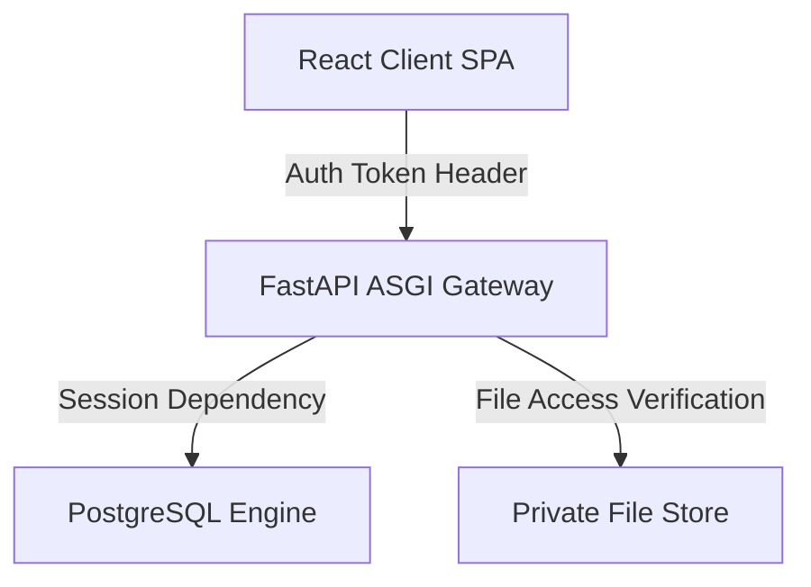

# Nerdshive Technical & Developer Handover Documentation

This document contains deep developer-level specifications for the Nerdshive Coworking Space Management System. It serves as the primary system design reference for future developers, deployment engineers, and code maintainers.

---

## 1. Directory Structure Tree

The project is structured as a decoupled monorepo:

```text
Nerdshive-Workspace/
├── .env                              # Global Docker/Env configuration
├── Dockerfile                        # Frontend production build container
├── docker-compose.yml                # Composition configuration file
├── package.json                      # Frontend library listings
├── tsconfig.json                     # TypeScript configuration
├── vite.config.ts                    # Vite client config
├── backend/
│   ├── Dockerfile                    # Backend production container config
│   ├── alembic.ini                   # Alembic database migrations settings
│   ├── requirements.txt              # Backend dependencies
│   ├── alembic/                      # Alembic schema versions
│   └── app/
│       ├── main.py                   # FastAPI Application Entrypoint
│       ├── api/                      # Routing layers
│       │   ├── deps.py               # Security and Session dependency inject
│       │   └── v1/
│       │       ├── api.py            # API V1 Router Registration
│       │       └── endpoints/        # Endpoints controller files
│       ├── core/                     # Configurations, Mailer, Cryptography
│       ├── db/                       # SQLAlchemy Session local engine
│       ├── models/                   # SQLAlchemy declarative DB mappings
│       └── schemas/                  # Pydantic serialization definitions
└── src/
    ├── App.tsx                       # React entry router mapping
    ├── components/                   # Tab views and custom modals
    ├── hooks/                        # Custom hooks (e.g. use-toast)
    ├── services/                     # HTTP client API fetch layers
    └── pages/                        # View layout components
```

---

## 2. System Architecture



### Component-Level Architecture

* **Database Connection pool**: The backend uses SQLAlchemy `create_engine` with `pool_pre_ping=True` inside [session.py](file:///e:/1/backend/app/db/session.py) to recycle dead connections and prevent timeouts.
* **REST Routing Layers**: [api.py](file:///e:/1/backend/app/api/v1/api.py) exposes modules under namespace prefix `/api/v1/`.
* **Security Dependency Injectors**: Checks roles, retrieves sessions, and verifies user status in [deps.py](file:///e:/1/backend/app/api/deps.py).
* **SPA Routing & Guards**: Frontend uses `<BrowserRouter>` and a custom `<AuthGuard>` to control view access based on backend session data.

---

## 3. Database Schema Specifications

The database contains 15 tables managed via Alembic migrations.

### Schema Relationships
* `auth_users` has a 1-to-1 relationship with `users` (Coworker), `admins`, and `superuser` profiles.
* `users` has a 1-to-many relationship with `plans` and `checkins`.
* `plans` has a 1-to-many relationship with `checkins` (identifying which plan a coworker uses for a visit).
* `auth_users` acts as the authorizer or modifier for `checkins`, `pricing`, `queries`, and `updates` tables.

### Table Definitions

#### 1. `auth_users`
Stores user credentials and authentication states.
* **id**: `UUID` (Primary Key, Default: `uuid.uuid4`)
* **email**: `VARCHAR` (Unique, Indexed, Not Null)
* **hashed_password**: `VARCHAR` (Not Null)
* **is_active**: `BOOLEAN` (Default: `TRUE`)
* **created_at**: `TIMESTAMP` (Default: `now()`)

#### 2. `users`
Customer profile details.
* **id**: `UUID` (Primary Key, Default: `uuid.uuid4`)
* **auth_id**: `UUID` (Foreign Key -> `auth_users.id`, Unique, Not Null, `ON DELETE CASCADE`)
* **email**: `VARCHAR` (Unique, Indexed, Not Null)
* **full_name**: `VARCHAR` (Not Null)
* **gender**: `VARCHAR` (Nullable)
* **date_of_birth**: `DATE` (Nullable)
* **mobile**: `VARCHAR` (Not Null)
* **emergency_contact_name**: `VARCHAR` (Nullable)
* **emergency_contact_number**: `VARCHAR` (Not Null, Default: `""`)
* **org_name**: `VARCHAR` (Not Null, Default: `""`)
* **department**: `VARCHAR` (Nullable)
* **designation**: `VARCHAR` (Nullable)
* **employee_id**: `VARCHAR` (Nullable)
* **joining_date**: `DATE` (Nullable)
* **duration**: `VARCHAR` (Nullable)
* **govt_id_type**: `VARCHAR` (Not Null, Default: `""`)
* **govt_id_number**: `VARCHAR` (Not Null, Default: `""`)
* **requires_parking**: `BOOLEAN` (Default: `FALSE`)
* **vehicle_type**: `VARCHAR` (Nullable)
* **vehicle_brand_model**: `VARCHAR` (Nullable)
* **vehicle_color**: `VARCHAR` (Nullable)
* **vehicle_registration**: `VARCHAR` (Nullable)
* **customer_id**: `VARCHAR` (Unique, Indexed, Nullable)
* **enrollment_source**: `VARCHAR` (Default: `"self_registered"`)
* **customer_photo_url**: `VARCHAR` (Nullable)
* **is_approved**: `BOOLEAN` (Default: `FALSE`)
* **is_active**: `BOOLEAN` (Default: `TRUE`)
* **created_at**: `TIMESTAMP` (Default: `now()`)
* **updated_at**: `TIMESTAMP` (Default: `now()`)
* **city**: `VARCHAR` (Nullable)
* **location**: `VARCHAR` (Nullable)
* **occupation**: `VARCHAR` (Nullable)
* **govt_id_copy_url**: `VARCHAR` (Nullable)
* **reimbursement**: `BOOLEAN` (Default: `FALSE`)
* **gst_number**: `VARCHAR` (Nullable)
* **org_location**: `VARCHAR` (Nullable)

#### 3. `admins`
Admin profiles.
* **id**: `UUID` (Primary Key, Default: `uuid.uuid4`)
* **auth_id**: `UUID` (Foreign Key -> `auth_users.id`, Unique, Not Null, `ON DELETE CASCADE`)
* **full_name**: `VARCHAR` (Nullable)
* **mobile**: `VARCHAR` (Nullable)
* **city**: `VARCHAR` (Nullable)
* **location**: `VARCHAR` (Nullable)
* **occupation**: `VARCHAR` (Nullable)
* **created_at**: `TIMESTAMP` (Default: `now()`)

#### 4. `superuser`
Superuser profiles.
* **id**: `UUID` (Primary Key, Default: `uuid.uuid4`)
* **auth_id**: `UUID` (Foreign Key -> `auth_users.id`, Unique, Not Null, `ON DELETE CASCADE`)
* **full_name**: `VARCHAR` (Nullable)
* **mobile**: `VARCHAR` (Nullable)
* **city**: `VARCHAR` (Nullable)
* **location**: `VARCHAR` (Nullable)
* **occupation**: `VARCHAR` (Nullable)
* **created_at**: `TIMESTAMP` (Default: `now()`)

#### 5. `plans`
Coworking workspace plans booked by customers.
* **id**: `UUID` (Primary Key, Default: `uuid.uuid4`)
* **user_id**: `UUID` (Foreign Key -> `users.id`, Not Null, `ON DELETE CASCADE`)
* **plan_type**: `VARCHAR` (Not Null) e.g., `'day'`, `'week'`, `'month'`
* **amount**: `NUMERIC` (Not Null)
* **start_date**: `DATE` (Not Null)
* **end_date**: `DATE` (Not Null)
* **is_active**: `BOOLEAN` (Not Null, Default: `TRUE`)
* **payment_verified**: `BOOLEAN` (Default: `FALSE`)
* **created_at**: `TIMESTAMP` (Not Null, Default: `now()`)
* **updated_at**: `TIMESTAMP` (Not Null, Default: `now()`)

#### 6. `checkins`
Member space visits and check-in logs.
* **id**: `UUID` (Primary Key, Default: `uuid.uuid4`)
* **user_id**: `UUID` (Foreign Key -> `users.id`, Not Null, `ON DELETE CASCADE`)
* **plan_id**: `UUID` (Foreign Key -> `plans.id`, Not Null, `ON DELETE CASCADE`)
* **checkin_time**: `TIMESTAMP` (Nullable)
* **checkout_time**: `TIMESTAMP` (Nullable)
* **checkin_approved**: `BOOLEAN` (Default: `FALSE`)
* **checkin_approved_by**: `UUID` (Foreign Key -> `auth_users.id`, Nullable, `ON DELETE SET NULL`)
* **checkin_approved_at**: `TIMESTAMP` (Nullable)
* **status**: `VARCHAR` (Not Null, Default: `"pending"`) e.g., `'pending'`, `'checked_in'`, `'checked_out'`
* **payment_status**: `VARCHAR` (Default: `"pending"`)
* **payment_rejection_date**: `TIMESTAMP` (Nullable)
* **expired**: `BOOLEAN` (Default: `FALSE`)
* **updated_by**: `UUID` (Foreign Key -> `auth_users.id`, Nullable, `ON DELETE SET NULL`)
* **created_at**: `TIMESTAMP` (Not Null, Default: `now()`)
* **updated_at**: `TIMESTAMP` (Not Null, Default: `now()`)

#### 7. `pricing`
Pass catalog configuration.
* **id**: `UUID` (Primary Key, Default: `uuid.uuid4`)
* **plan_type**: `VARCHAR` (Unique, Not Null) e.g., `'day'`, `'week'`, `'month'`
* **amount**: `NUMERIC` (Not Null)
* **gst_rate**: `NUMERIC` (Not Null, Default: `18`)
* **updated_by**: `UUID` (Foreign Key -> `auth_users.id`, Nullable, `ON DELETE SET NULL`)
* **updated_at**: `TIMESTAMP` (Not Null, Default: `now()`)

#### 8. `notifications`
System alerts pushed to users.
* **id**: `UUID` (Primary Key, Default: `uuid.uuid4`)
* **user_id**: `UUID` (Foreign Key -> `auth_users.id`, Not Null, `ON DELETE CASCADE`)
* **title**: `VARCHAR` (Not Null)
* **message**: `VARCHAR` (Not Null)
* **type**: `VARCHAR` (Not Null, Default: `"info"`)
* **is_read**: `BOOLEAN` (Not Null, Default: `FALSE`)
* **data**: `JSONB` (Nullable)
* **created_at**: `TIMESTAMP` (Not Null, Default: `now()`)

#### 9. `activity_logs`
Audit trails for actions done by Admins and Superusers.
* **id**: `UUID` (Primary Key, Default: `uuid.uuid4`)
* **action**: `VARCHAR` (Not Null)
* **performed_by**: `UUID` (Foreign Key -> `auth_users.id`, Nullable, `ON DELETE SET NULL`)
* **performed_by_name**: `VARCHAR` (Nullable)
* **performed_by_role**: `VARCHAR` (Nullable)
* **target_user_id**: `UUID` (Nullable)
* **target_user_name**: `VARCHAR` (Nullable)
* **target_user_email**: `VARCHAR` (Nullable)
* **details**: `JSONB` (Nullable)
* **created_at**: `TIMESTAMP` (Not Null, Default: `now()`)

#### 10. `updates`
Announcements visible to customers.
* **id**: `UUID` (Primary Key, Default: `uuid.uuid4`)
* **message**: `VARCHAR` (Not Null)
* **type**: `VARCHAR` (Nullable)
* **user_id**: `UUID` (Foreign Key -> `auth_users.id`, Nullable, `ON DELETE SET NULL`)
* **created_at**: `TIMESTAMP` (Not Null, Default: `now()`)

#### 11. `admin_tab_views`
Monitors admin read state of logs.
* **id**: `UUID` (Primary Key, Default: `uuid.uuid4`)
* **admin_id**: `UUID` (Foreign Key -> `auth_users.id`, Not Null, `ON DELETE CASCADE`)
* **tab_name**: `VARCHAR` (Not Null)
* **last_viewed_at**: `TIMESTAMP` (Not Null, Default: `now()`)
* **created_at**: `TIMESTAMP` (Not Null, Default: `now()`)

#### 12. `usage_logs`
Coworker access logs.
* **id**: `UUID` (Primary Key, Default: `uuid.uuid4`)
* **user_id**: `UUID` (Foreign Key -> `auth_users.id`, Nullable, `ON DELETE CASCADE`)
* **details**: `JSONB` (Nullable)
* **created_at**: `TIMESTAMP` (Not Null, Default: `now()`)

#### 13. `queries`
User support tickets/inquiries.
* **id**: `UUID` (Primary Key, Default: `uuid.uuid4`)
* **user_id**: `UUID` (Foreign Key -> `auth_users.id`, Nullable, `ON DELETE CASCADE`)
* **message**: `VARCHAR` (Not Null)
* **response**: `VARCHAR` (Nullable)
* **status**: `VARCHAR` (Default: `"pending"`)
* **created_at**: `TIMESTAMP` (Not Null, Default: `now()`)

#### 14. `content_sections`
Content details like Wi-Fi details, guides, and policies.
* **id**: `UUID` (Primary Key, Default: `uuid.uuid4`)
* **section**: `VARCHAR` (Unique, Not Null) e.g., `'rules'`, `'guide'`, `'wifi'`
* **content**: `VARCHAR` (Not Null)
* **updated_at**: `TIMESTAMP` (Default: `now()`)

#### 15. `revoked_tokens`
Invalidated JWT tokens.
* **id**: `VARCHAR` (Primary Key)
* **created_at**: `TIMESTAMP` (Default: `now()`)

---

## 4. API Documentation & OpenAPI Schema Reference

The endpoints conform to the following schemas:

### Schemas & Models

#### `AuthUserCreate`
```json
{
  "email": "user@example.com",
  "password": "minimum_8_characters_string"
}
```

#### `UserCreate`
```json
{
  "auth_id": "3fa85f64-5717-4562-b3fc-2c963f66afa6",
  "email": "user@example.com",
  "full_name": "John Doe",
  "mobile": "9876543210",
  "gender": "male",
  "city": "Chennai",
  "location": "T Nagar",
  "occupation": "Software Developer",
  "govt_id_type": "passport",
  "govt_id_number": "A1234567",
  "govt_id_copy_url": "id-proofs/uid/govt-id.jpg",
  "customer_photo_url": "customer-photos/uid/photo.jpg",
  "reimbursement": true,
  "org_name": "ACME Corp",
  "gst_number": "22ABCDE1234F1Z5",
  "org_location": "Chennai Office"
}
```

#### `CheckinCreate`
```json
{
  "user_id": "3fa85f64-5717-4562-b3fc-2c963f66afa6",
  "plan_id": "3fa85f64-5717-4562-b3fc-2c963f66afa6"
}
```

#### `BulkEnrollInput`
```json
{
  "csvData": "Name,Email,Mobile,Date of Birth,Company Name...\nJohn Doe,john@example.com,9876543210,15-08-1990...",
  "fileName": "corporate_list.csv"
}
```

---

## 5. Security Architecture

### Role-Based Access Control
RBAC validation logic is implemented in the dependencies defined in [deps.py](file:///e:/1/backend/app/api/deps.py):
* **`get_current_auth_user`**: Decodes JWT access token using the signature secret key `SECRET_KEY` and algorithm `HS256`. Verifies the user type is `access` and checks that the user exists in `auth_users` table and is marked `is_active = True`.
* **`get_current_admin`**: First retrieves the authenticated user, then queries the `admins` and `superuser` tables to assert administrative rights.
* **`get_current_superuser`**: Restricts actions exclusively to users with profiles in the `superuser` table.

### File Security & Signed URL Simulation
To prevent unauthorized access to sensitive government ID proofs and selfie files:
1. All file uploads are stored in private storage directories (`/app/storage/`) that are not directly served or accessible by host directory mapping.
2. The frontend calls `GET /api/v1/storage/{bucket}/{path}` to get a simulated signed URL.
3. The backend returns a temporary URL pointing to `GET /api/v1/storage/raw/{bucket}/{path}`.
4. When requesting the raw image payload, the backend checks that the requester's ID matches the owner ID in the file path, or that the requester is a verified Admin or Superuser. If unauthorized, the API returns a `403 Forbidden` error.

---

## 6. Infrastructure & Deployment Guide

Nerdshive runs as a multi-container Docker Compose application.

### Environment Configuration Variables (`.env`)

```ini
# Frontend settings
VITE_API_URL="http://localhost:8001/api/v1"

# Database Configuration (PostgreSQL 15 Container)
POSTGRES_USER=app_user
POSTGRES_PASSWORD=password123
POSTGRES_DB=app_db

# Backend App Settings (FastAPI)
PROJECT_NAME="Nerdshive Core API"
DATABASE_URL="postgresql://app_user:password123@db:5432/app_db"
SECRET_KEY="generate_a_very_secure_long_random_string_here_for_jwt"
ALGORITHM="HS256"
ACCESS_TOKEN_EXPIRE_MINUTES=10080  # 7 days

# File Storage Configuration
STORAGE_DIR="/app/storage"
```

### Production Deployment Commands

1. **Start Services**:
   ```bash
   docker-compose up --build -d
   ```
2. **Apply Database Migrations**:
   ```bash
   docker-compose exec backend alembic upgrade head
   ```
3. **Execute Database Seeding**:
   ```bash
   docker-compose exec backend python scratch/seed_users.py
   ```

### Backup & Recovery Scripts

#### Backup Command
```bash
docker exec -t app_postgres pg_dump -U app_user -d app_db > nerdshive_backup.sql
```

#### Restore Command
```bash
docker exec -i app_postgres psql -U app_user -d app_db < nerdshive_backup.sql
```

---

## 7. Testing Guide

Manual integration checks are located under `/scratch/`.

* **`scratch/test_bulk_enroll.py`**: Validates CSV parsing logic, mapping headers, sequence ID increments, and password generation.
* **`scratch/test_reject_user.py`**: Verifies user rejection cascades and deletes matching records.
* **`scratch/test_query_response.py`**: Asserts query replies are serialized correctly.
* **`scratch/test_storage_url.py`**: Validates simulated signed URL logic and file access security checks.
